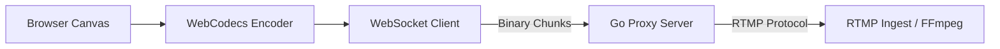

# CanvaStream

A high-performance real-time canvas streaming system using **WebCodecs API**, **WebSockets**, and **Go**.

## Overview

CanvaStream allows you to capture a `canvas` element in the browser, encode it to H.264 in real-time using native hardware acceleration (where available), and stream it to an RTMP destination through a lightweight Go proxy.

## Architecture



- **Frontend (Next.js)**: Uses `VideoEncoder` to compress canvas frames into H.264 NAL units.
- **Protocol**: Custom binary framing: `[Type:1b] [Timestamp:4b BE] [Payload:Nb]`.
- **Backend (Go)**: A high-concurrency WebSocket server that manages RTMP sessions and forwards packets without re-encoding.

## Getting Started

### Prerequisites

- **Go 1.25+**
- **Node.js 20+**
- **FFmpeg** (for testing)

### Installation

1. Clone the repository:
   ```bash
   git clone <repo-url>
   cd canvastream
   ```

2. Install frontend dependencies:
   ```bash
   cd web
   npm install
   ```

3. Initialize Go modules:
   ```bash
   cd ../server
   go mod download
   ```

### Running Locally

1. **Start RTMP Listener (FFmpeg)**:
   ```bash
   ffmpeg -y -listen 1 -i rtmp://0.0.0.0:1935 -c copy -movflags +faststart /tmp/output.mp4
   ```

2. **Start Go Server**:
   ```bash
   cd server
   go run .
   ```

3. **Start Web App**:
   ```bash
   cd web
   npm run dev
   ```

Open [http://localhost:3000](http://localhost:3000) to start streaming.

## License

MIT
